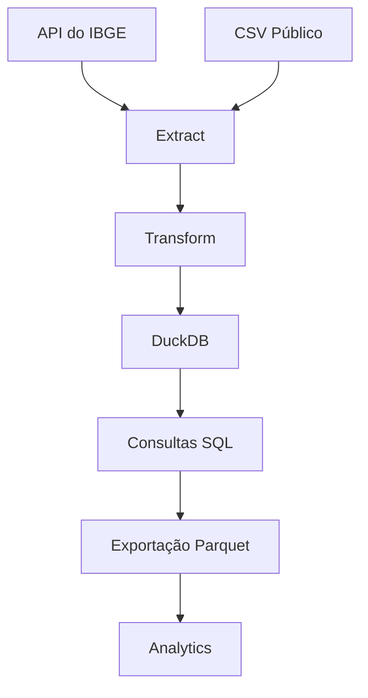

# Public Data ETL Pipeline | Python • DuckDB • Parquet

Pipeline ETL desenvolvido em Python para ingestão, transformação e armazenamento de dados públicos brasileiros utilizando DuckDB e Parquet.

Projeto de Engenharia de Dados que implementa um pipeline ETL completo utilizando dados públicos do IBGE.
O pipeline realiza ingestão, transformação, persistência em DuckDB e exportação em Parquet, simulando um fluxo utilizado em ambientes corporativos.

O pipeline realiza:

- Extração de dados via API pública do IBGE
- Ingestão de arquivos CSV públicos
- Transformação e normalização de dados
- Armazenamento em DuckDB
- Exportação otimizada em Parquet
- Particionamento por UF
- Consultas analíticas utilizando SQL

---
## Skills Demonstrated

- ETL Pipeline Development
- Data Extraction from REST APIs
- Data Transformation with Pandas
- SQL Analytics
- DuckDB
- Parquet
- Data Modeling
- Data Engineering

---

## Fluxo do Pipeline



---
## Tecnologias utilizadas

| Tecnologia | Finalidade |
|------------|------------|
| Python | Desenvolvimento do pipeline |
| Pandas | Transformação de dados |
| Requests | Consumo da API |
| DuckDB | Banco analítico |
| SQL | Consultas analíticas |
| Parquet | Armazenamento otimizado |

---
## Por que DuckDB?

DuckDB foi escolhido por oferecer processamento analítico extremamente rápido, suporte nativo a Parquet e integração simples com Pandas, sendo muito utilizado em pipelines modernos de dados.

---
# Estrutura do Projeto

```text
pipeline-etl-dados-publicos
│
├── data
│   ├── raw
│   ├── processed
│   ├── curated
│   └── etl.db
│
├── src
│   ├── extract.py
│   ├── transform.py
│   ├── load.py
│   └── main.py
│
└── README.md
```

---

# Arquitetura ETL

## Extract

Responsável pela ingestão de dados públicos:

- API do IBGE
- CSV público de municípios brasileiros

Arquivos gerados:

```text
data/raw
```

---

## Transform

Responsável pelo tratamento dos dados:

- Normalização do JSON
- Padronização de colunas
- Tratamento de estruturas aninhadas
- Geração de arquivos tratados

Arquivos gerados:

```text
data/processed
```

---

## Load

Responsável pelo carregamento analítico:

- Criação de tabelas no DuckDB
- Execução de JOINs
- Consultas SQL
- Exportação em Parquet
- Particionamento por UF

Arquivos gerados:

```text
data/curated
```

---

# Funcionalidades implementadas

- Consumo de API pública
- Leitura de CSV
- Transformação de dados
- JOIN entre tabelas
- SQL analítico
- Exportação Parquet
- Particionamento de dados
- Estrutura em camadas

---

# Exemplo de JOIN

```sql
SELECT
    m.municipio,
    m.uf,
    p.ddd
FROM municipios m
LEFT JOIN populacao p
    ON m.id_municipio = p.id_municipio
```

---

# Como executar o projeto

## Instalar dependências

```bash
pip install pandas requests duckdb pyarrow
```

## Executar pipeline completo

```bash
python src/main.py
```
---
## Pipeline Output

Depois da execução do pipeline é gerado:

- Banco analítico DuckDB (`etl.db`)
- Arquivos Parquet 
- Dados particionados por UF
- Estruturas para análise em SQL


---

# Estrutura de saída

## Banco DuckDB

```text
data/etl.db
```

## Arquivos Parquet

```text
data/curated
```

---

# Objetivos do projeto

Este projeto foi desenvolvido para prática de:

- Engenharia de Dados
- ETL
- Manipulação de dados públicos
- SQL analítico
- DuckDB
- Particionamento de dados
- Estruturação de pipelines
- Modelagem analítica

---

# Melhorias futuras

- Integração com Power BI
- Logging
- Docker
- Airflow
- Testes automatizados
- Incremental Load
- Dashboard analítico
